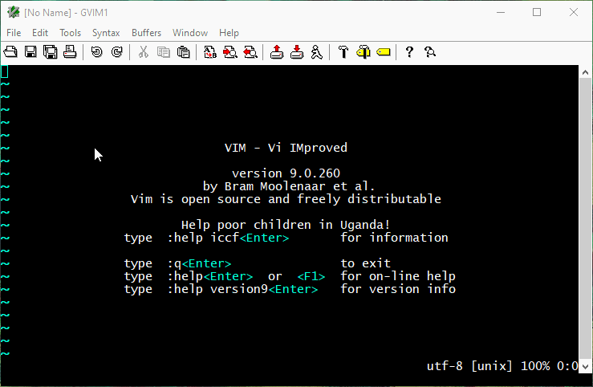

### vim colors theme simple



#### Setting configurasi vimrc untuk warna yang lengkap sesuai kebutuhan:

###### pengguna (Python dan Java)
```
let python_highlight_all=1
let java_highlight_all=1
```
###### pengguna c/c++
- [https://github.com/octol/vim-cpp-enhanced-highlight](https://github.com/octol/vim-cpp-enhanced-highlight)

